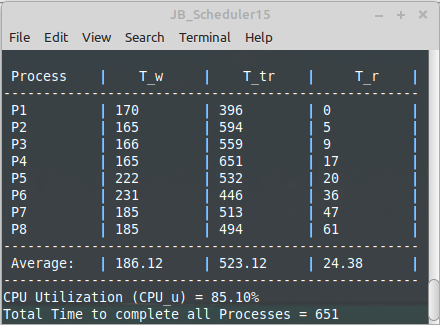
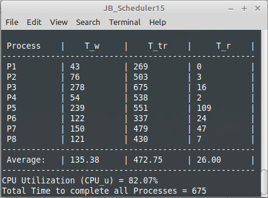
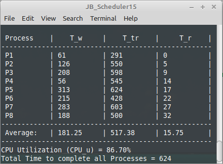

# CPU Process Scheduler
### Operating Systems Scheduling Algorithm Implementation

<div align="center">

[](https://github.com/ADolbyB/process-scheduler/stargazers)
[](https://github.com/ADolbyB/process-scheduler/network/members)
[](https://github.com/ADolbyB/process-scheduler)
[](https://github.com/ADolbyB/process-scheduler/commits/main)

**Operating Systems Course Project - Grade: 98/100**

[](https://isocpp.org/)
[](https://www.linux.org/)
[](http://www.codeblocks.org/)

**Developed by:** [](https://github.com/ADolbyB)

</div>

---

## 🎯 Project Overview

A comprehensive **CPU process scheduling simulator** implementing three fundamental operating system scheduling algorithms. This project demonstrates core OS concepts including process management, queue data structures, CPU burst scheduling, and I/O handling using predefined process workloads.

**Key Features:**
- ✅ Three distinct scheduling algorithms (FCFS, SJF, MLFQ)
- ✅ Custom queue implementations for process management
- ✅ Realistic CPU and I/O burst simulation
- ✅ Performance metrics and visualization
- ✅ GDB debugging support

---

## 🏆 Academic Achievement

**Course:** Operating Systems  
**Institution:** Florida Atlantic University  
**Semester:** Fall 2021  
**Final Grade:** **98/100**

This project earned near-perfect marks for implementing complex scheduling algorithms with clean, efficient C++ code and proper data structure design.

---

## 📚 Scheduling Algorithms Implemented

### 1. FCFS - First Come First Served

**Algorithm Type:** Non-preemptive

**Description:**
- Single Ready Queue and single I/O Queue
- Processes execute in order of arrival
- Each process runs until CPU burst completion
- Simple but can suffer from convoy effect
- Worst case scenario benchmark for average total wait time `T_w`

**Characteristics:**
- No process starvation
- Low scheduling overhead
- Poor average waiting time for short processes
- Ideal for batch processing systems

**Queue Structure:**
```
Ready Queue: [P1] → [P2] → [P3] → [P4]
                ↓ (CPU Burst Complete)
I/O Queue:   [P1] → [P2] → ...
```

---

### 2. SJF - Shortest Job First

**Algorithm Type:** Non-preemptive

**Description:**
- Single Ready Queue and single I/O Queue
- Processes ordered by shortest CPU burst time
- Minimizes average waiting time
- Requires knowledge of burst times (predefined in this implementation)
- Best case scenario benchmark for average total wait time `T_w`

**Characteristics:**
- Optimal average waiting time
- Risk of starvation for long processes
- Efficient for known workloads
- Difficult to implement in real systems (requires prediction)

**Queue Structure:**
```
Ready Queue (sorted by burst time):
[P3: 5ms] → [P1: 10ms] → [P4: 15ms] → [P2: 20ms]
```

---

### 3. MLFQ - Multi-Level Feedback Queue

**Algorithm Type:** Preemptive

**Description:**
- Three-tier Ready Queue system with priority levels
- Single I/O Queue
- Dynamic priority adjustment based on behavior
- Prevents starvation while favoring interactive processes

**Queue Structure:**
```
Queue 1 (Highest Priority): Round Robin (Time Quantum T_q = 5)
Queue 2 (Medium Priority):  Round Robin (Time Quantum T_q = 10)
Queue 3 (Lowest Priority):  FCFS (No time quantum)
I/O Queue:                  FCFS (Unlimited devices)
```

**Priority Rules:**
- New processes and I/O returning processes → Queue 1
- Process doesn't complete in Queue 1 → Demoted to Queue 2
- Process doesn't complete in Queue 2 → Demoted to Queue 3
- Higher queues preempt lower queues
- Queue N only runs when Queues 1 through N-1 are empty

**Advantages:**
- Balances turnaround time and response time
- Adapts to process behavior dynamically
- Prevents starvation through aging
- Favors I/O-bound (interactive) processes

---

## 🔧 Technical Implementation

### Process Definition

Each process consists of alternating CPU and I/O burst times:

```cpp
Process Structure: {CPU, I/O, CPU, I/O, ..., CPU}
```

**Requirements:**
- ✅ Must begin with a CPU burst
- ✅ Must end with a CPU burst
- ✅ Alternates between CPU and I/O operations

**Example Process:**
```cpp
Process P1 = {5, 3, 8, 4, 6};  // CPU → I/O → CPU → I/O → CPU
```

### I/O Handling

**Unlimited I/O Devices Assumption:**
- All processes in I/O queue execute simultaneously
- All I/O burst counters decrement in parallel
- Processes leave I/O queue immediately upon completion
- Realistic for systems with high I/O parallelism

### Queue Operations

**Key Operations Implemented:**
- `Make_process()` - makes a queue of nodes by reading a process file
- `add_back()` - Add a node to the BACK
- `deQueue()` - delete a node from the FRONT
- `Print_proc_nodes()` - iterates the queue and prints the list of nodes
- `remove()` - removes a node from the middle of a queue
- `FCFS_SJF_increment_wait()` - increments the wait times of processes in the ready queue
- `FCFS_SJF_add_to_queue()` - ONLY for FCFS and SJF to transfer nodes between queues
- `FCFS_SJF_CPU_queue_timer()` - decrements CPU time of front node and increments global clock
- `FCFS_SJF_IO_queue_timer()` - decrements I/O time of all nodes simultaneously, increments total IO clock
- `MLFQ_increment_wait()` - increments all wait times of all ready queues for MLFQ
- `MLFQ_add_to_queue()` - ONLY for MLFQ to transfer nodes between queues
- `MLFQ_CPU_timer()` - Function only called for MLFQ Queue timers: Called by `Ready_1()`
- `MLFQ_IO_queue_timer()`- decrements I/O time of entire queue,increments total IO clock
- `Print_ready_IO()` - iterates the queue and prints the list of nodes.
- `Results()` - calculates and prints results: Ave T_wait, Ave T_turnaround, Ave T_response

---

## 📂 Repository Structure

```
process-scheduler/
├── Documentation/            # Project screenshots
│   ├── Results_FCFS.png      # FCFS algorithm output
│   ├── Results_SJF.png       # SJF algorithm output
│   └── Results_MLFQ.png      # MLFQ algorithm output
├── Processes/                # Process definition files
│   ├── p1.txt                # Predefined Process 1
│   ├── p2.txt                # Predefined Process 2
│   ├── ...
│   └── p8.txt                # Predefined Process 8
├── processes.h               # Process structure declarations
├── processes.cpp             # Process management implementation
├── queues.cpp                # Queue data structure implementation
├── sched_driver.cpp          # Main driver and scheduling logic
└── README.md                 # This document
```

---

## 🚀 Getting Started

### Prerequisites

**Development Environment:**
- Linux operating system (Ubuntu, Mint, Fedora, etc.)
- GNU g++ compiler (C++11 or higher)
- Code::Blocks IDE v20.03+ (optional)
- GDB debugger (for debugging)
- Make build system (optional)

### Compilation

**Method 1: Command Line (Recommended)**

```bash
# Clone the repository
git clone https://github.com/ADolbyB/process-scheduler.git
cd process-scheduler

# Compile with g++
g++ -std=c++11 -Wall -Werror *.cpp *.h -o sched_driver

# Run the scheduler
./sched_driver
```

**Method 2: With Debugging Support**

```bash
# Compile with debug symbols
g++ -g -std=c++11 -Wall -Werror *.cpp *.h -o sched_driver

# Launch with GDB
gdb ./sched_driver

# GDB commands:
# (gdb) run              - Start execution
# (gdb) break main       - Set breakpoint
# (gdb) next             - Step over
# (gdb) step             - Step into
# (gdb) print variable   - Inspect variable
# (gdb) quit             - Exit GDB
```

**Method 3: Code::Blocks IDE**

1. Launch Code::Blocks IDE
2. Create New Project:
   - File → New → Project
   - Console Application → C++
   - Name: `process-scheduler`
   - Select project location
   - Compiler: GNU GCC
3. Remove default `main.cpp`
4. Add project files:
   - Right-click project → Add files
   - Select all `.cpp` and `.h` files
5. Build and Run: F9

### Usage

```bash
$ ./sched_driver

=== CPU Process Scheduler ===
Select Scheduling Algorithm:
1. FCFS (First Come First Served)
2. SJF  (Shortest Job First)
3. MLFQ (Multi-Level Feedback Queue)
4. Exit

Enter choice (1-4): 
```

Select algorithm by number and observe:
- Process execution timeline
- Queue state changes
- CPU utilization
- Average waiting time
- Average turnaround time

---

## 📊 Output Examples

### FCFS Algorithm Output

[](Documentation/Results_FCFS.png)

**Performance Characteristics:**
- Execution order: P1 → P2 → P3 → P4 (arrival order)
- No preemption or reordering
- Simple but potentially inefficient

---

### SJF Algorithm Output

[](Documentation/Results_SJF.png)

**Performance Characteristics:**
- Execution order: Sorted by CPU burst length
- Minimizes average waiting time
- Optimal for known workloads

---

### MLFQ Algorithm Output

[](Documentation/Results_MLFQ.png)

**Performance Characteristics:**
- Dynamic priority adjustment
- Time quantum enforcement
- Queue demotion on timeout
- Responsive to interactive processes

---

## 💡 Key Concepts Demonstrated

### Operating Systems Theory

| Concept | Implementation |
|---------|----------------|
| **Process Scheduling** | Three distinct algorithms with different policies |
| **Context Switching** | Preemption in MLFQ with state preservation |
| **Queue Management** | Custom queue data structures for process lists |
| **CPU Burst** | Timed execution periods for computational work |
| **I/O Burst** | Simulated I/O operations with wait times |
| **Priority Scheduling** | Multi-level queues with dynamic priorities |
| **Starvation Prevention** | MLFQ aging and priority boost mechanisms |

### Data Structures

- **Linked List Queues** - Dynamic process queue management
- **Process Control Blocks (PCBs)** - Process state and metadata
- **Priority Queues** - SJF ordered insertion
- **Multi-Queue System** - MLFQ three-tier structure

### Performance Metrics

**Calculated for each algorithm:**
- Average Waiting Time
- Average Turnaround Time
- CPU Utilization
- Context Switch Count

---

## 🧪 Testing & Validation

**Test Cases:**
- ✅ Single process execution
- ✅ Multiple processes with varying burst times
- ✅ I/O-bound vs CPU-bound process mixes
- ✅ Process arrival order variations
- ✅ Queue preemption scenarios (MLFQ)
- ✅ Edge cases (empty queues, single burst processes)

**Validation Methods:**
- Manual calculation verification
- Output log analysis
- Performance metric comparison
- GDB step-through debugging

---

## 📖 Learning Outcomes

**Skills Demonstrated:**
- ✅ Operating system scheduling algorithm implementation
- ✅ Custom data structure design (queues, process lists)
- ✅ C++ object-oriented programming
- ✅ Pointer management and memory efficiency
- ✅ Algorithm complexity analysis
- ✅ Linux development environment proficiency
- ✅ Professional code documentation

---

## 🎓 Academic Context

**Course Learning Objectives Met:**
1. Understand CPU scheduling algorithms and policies
2. Implement process management data structures
3. Analyze algorithm performance trade-offs
4. Design efficient queue management systems
5. Debug complex C++ systems code

**Project Requirements:**
- Multiple scheduling algorithms
- Predefined process workloads
- Queue-based process management
- Performance metrics calculation
- Clean, documented code

---

## 🤝 Contributing

This is a completed academic project, but improvements are welcome:
- 📝 Documentation enhancements
- 🐛 Bug fixes
- 💡 Additional scheduling algorithms (Priority, Round Robin variants)
- 📊 Enhanced visualization
- ⚡ Performance optimizations

---

## 📄 License

This project is licensed under the GNU GPL v3 License - see the [LICENSE.md](https://github.com/ADolbyB/process-scheduler/blob/main/LICENSE.md) file for details.

**Academic Integrity Notice:** This repository represents completed coursework (98/100). Use as a learning resource to understand scheduling algorithms and C++ implementation, but develop your own solutions for assignments.

---

## 📧 Contact

**Developer:** [Joel Brigida](https://github.com/ADolbyB)  
**LinkedIn:** [Joel Brigida](https://www.linkedin.com/in/joelmbrigida/)  
**Course:** Operating Systems, Fall 2021

Questions about implementation details? Feel free to open an issue!

---

## 📊 Repository Stats

<div align="center">


</div>

---

<div align="center">

**Master Operating Systems. Understand Scheduling. Build Real Systems.**

*From theory to implementation - CPU scheduling algorithms in C++* ⚙️

[](https://github.com/ADolbyB)

</div>